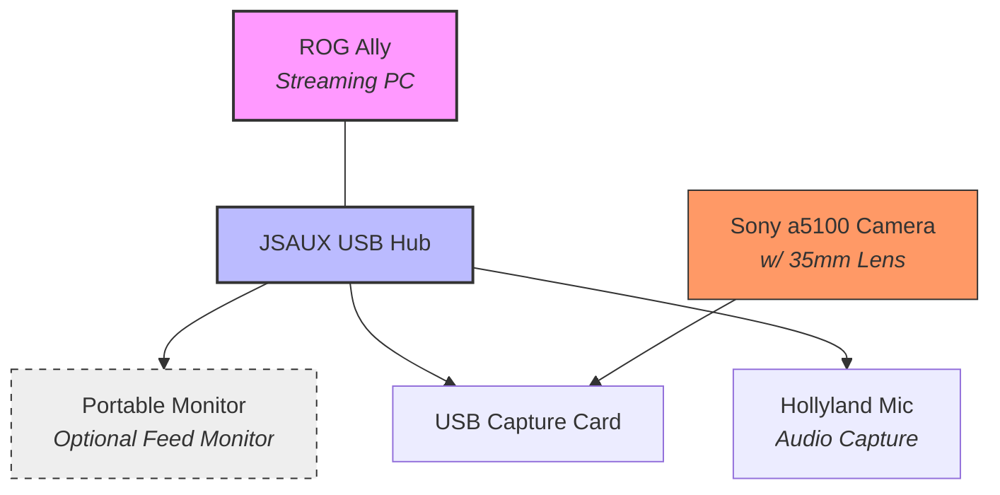

# Barebone Streaming
A simple, cheap, yet practical setup for streaming. Ensuring portability for a hassle-free setup.

 

## Background
This setup was needed by a client within a special request. Where i need to come up with a portable streaming solution with the company's limmited streaming gear without needing to buy anything new. Unlike many complex rigs, this setup has been fully tested, assembled, deployed, and tested by the client successfully, bringing a stable 2k views on tiktok. Which is proven to deliver real world performance while keeping the costs minimum.

## The Gear
* **ROG Ally:** Shocking, Used as a computer to stream
* **JSAUX USB hub:** Crucial to bridge all the device with stability
* **Portable Monitor (Optional):** To monitor the live feed
* **Sony a5100 with 35mm lens:** Used to capture the audience and the host
* **USB capture card:** Connects the camera feed to the ROG Ally
* **Hollyland mic:** Used for an audio capture with excellent battery life and noise cancelling

## The Software
* **Tiktok LIVE studio:** As the main application to stream requested by the client

## Wiring Diagram

